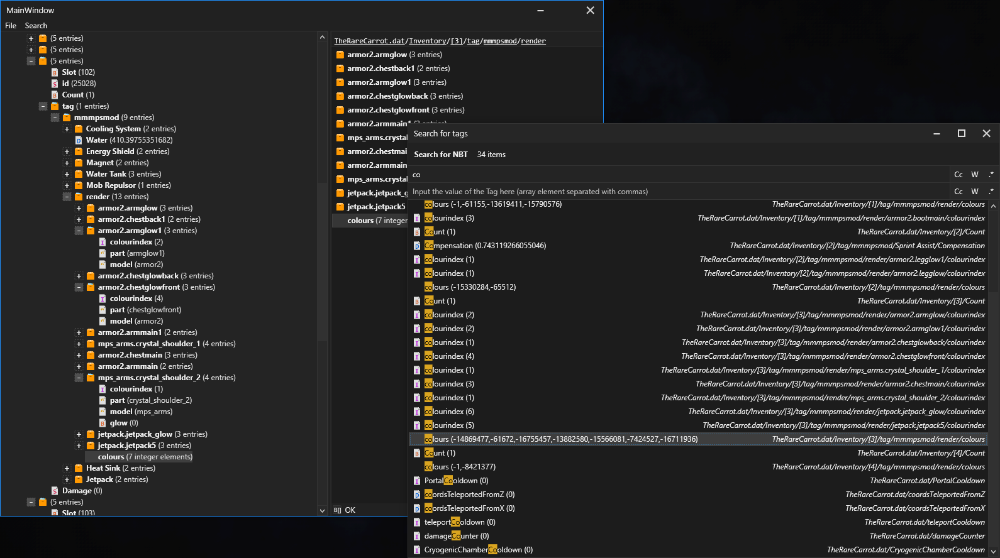

# MCNBTViewer
A minecraft NBT explorer/viewer written in C# using WPF MVVM

## Preview

## Multi-select
WPF doesn't seem to have a built in TreeView with multi selection, so I might try it myself at some point. The List on the right can do multiselect though, however,
the context menu actions only apply to the "anchor" item, which is typically the one you last selected with the mouse or up/down arrows (all without holding shift).
To delete multiple selected items, just select some items and click delete and it should cycle the selected items (I might add custom context items for multiselect soon)

## Building
You need to download and compile 1 library I have in another repo (https://github.com/AngryCarrot789/REghZyUtilsCS) called REghZy.Streams. This provides 
custom binary input/output streams because I really didn't like the build in C# ones, and I was also bored so why not write my own :/

Once you have that DLL compiles, you can reference it to both the WPF and Core project, and everything should compile
